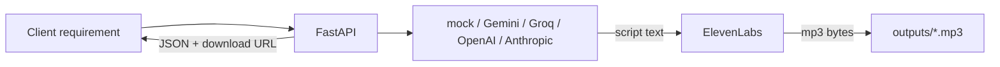

# Voice-driven requirement agent

This project turns a client requirement into speech audio:
**text requirement → LLM script generation → ElevenLabs TTS → MP3 file**.

It includes:

- FastAPI endpoints
- **Web UI** for generating and playing audio (no curl/Postman required)
- Swagger/ReDoc for API testing
- Agent-style tool loop (optional)
- Error handling and logging
- Retry logic for TTS failures
- Docker support (optional for containerized run)

## Improved project brief

1. **Input**: Client requirement in natural language.
2. **Reasoning**: LLM creates a single, clean narration script for speech.
3. **Tool loop (optional)**: model can call `emit_audio_script` with final narration text.
4. **Output**: MP3 file saved to disk + JSON metadata response.
5. **Reliability**: typed settings, retries, structured logs, API error mapping.

If you want a direct completion (without tool loop), set `AGENT_USE_TOOLS=false` or pass `"use_agent_tools": false`.

## Architecture




**Agent loop (when tools are on)** means: the model may take several turns; we stop as soon as `emit_audio_script` returns usable text, or fall back to plain assistant text if the provider returns content without a tool call (logged for traceability).

## Prerequisites

- Python **3.11+** (3.12 recommended)
- API keys (see next section)

## Environment variables

Copy the template and edit:

```bash
cp .env.example .env
```


| Variable                             | Required       | Where to get it                                                                                   |
| ------------------------------------ | -------------- | ------------------------------------------------------------------------------------------------- |
| `ELEVENLABS_API_KEY`                 | **Yes**        | [ElevenLabs → Profile → API keys](https://elevenlabs.io/app/settings/api-keys)                    |
| `LLM_PROVIDER`                       | No (`mock`)    | `mock`, `gemini`, `groq`, `openai`, or `anthropic`                                                |
| `LLM_FALLBACK_PROVIDER`              | No (`mock`)    | Auto fallback when primary provider hits quota/rate limits; set `none` to disable                 |
| `GEMINI_API_KEY` or `GOOGLE_API_KEY` | If `gemini`    | [Google AI Studio API key](https://aistudio.google.com/apikey) (free tier; either env name works) |
| `GEMINI_MODEL`                       | No             | Default `gemini-1.5-flash`                                                                        |
| `GEMINI_MODEL_CANDIDATES`            | No             | Comma-separated model retry chain when quota/rate-limit happens                                   |
| `GROQ_API_KEY`                       | If `groq`      | [Groq Console](https://console.groq.com/keys) (free; OpenAI-compatible)                           |
| `OPENAI_API_KEY`                     | If `openai`    | [OpenAI API keys](https://platform.openai.com/api-keys) (paid / credits)                          |
| `ANTHROPIC_API_KEY`                  | If `anthropic` | [Anthropic Console](https://console.anthropic.com/settings/keys)                                  |
| `GROQ_MODEL`                         | No             | Default `llama-3.1-8b-instant`                                                                    |
| `OPENAI_MODEL`                       | No             | Default `gpt-4o-mini`                                                                             |
| `ANTHROPIC_MODEL`                    | No             | Default `claude-3-5-sonnet-20241022`                                                              |
| `ELEVENLABS_VOICE_ID`                | No             | [Voices in dashboard](https://elevenlabs.io/app/voice-library); default is “George”               |
| `ELEVENLABS_MODEL_ID`                | No             | Default `eleven_multilingual_v2`                                                                  |
| `AGENT_USE_TOOLS`                    | No             | `true` / `false` — default `true`                                                                 |
| `AGENT_MAX_TURNS`                    | No             | Max LLM turns when tools are on (default `12`)                                                    |
| `LOG_LEVEL`                          | No             | e.g. `INFO`, `DEBUG`                                                                              |
| `OUTPUT_DIR`                         | No             | Directory for MP3 files (default `outputs`)                                                       |


**Security:** Never commit `.env`. It is listed in `.gitignore`.

### Easiest local testing (no paid LLM)

Set `LLM_PROVIDER=mock` in `.env`. The app builds a short template script **without** calling OpenAI, Anthropic, or Groq. You still need `ELEVENLABS_API_KEY` so audio can be generated.

For a **free** real LLM, use `**LLM_PROVIDER=gemini`** with `GEMINI_API_KEY` (or `GOOGLE_API_KEY`) from [Google AI Studio](https://aistudio.google.com/apikey), or use `LLM_PROVIDER=groq` with [Groq](https://console.groq.com/keys).  
Gemini now automatically retries across `GEMINI_MODEL_CANDIDATES` when a model hits quota/rate-limit, then falls back via `LLM_FALLBACK_PROVIDER` if all candidates fail.

### Troubleshooting: ElevenLabs free-plan voice error (402)

If you see `paid_plan_required` from ElevenLabs, your selected voice is likely a library voice not allowed on free plan.  
Use a public/premade voice (for example `JBFqnCBsd6RMkjVDRZzb`) in `ELEVENLABS_VOICE_ID`.  
The app now also auto-tries several public fallback voices when this happens.

### Troubleshooting: OpenAI `insufficient_quota` / 429

If you see quota errors from OpenAI, your account has no usable credits or billing for that key. Switch to `LLM_PROVIDER=mock` or `groq`, or add billing/credits on OpenAI. The API now returns **402** with a clear message instead of a generic 502 when this specific error occurs.

## Quick start (one command)

Use the provided launcher script so you do not run commands one by one:

```bash
chmod +x run.sh
./run.sh
```

### What `run.sh` does

1. Creates a Python virtual environment (`.venv`) if it does not exist
2. Activates the venv and installs dependencies from `requirements.txt`
3. Copies `.env.example` → `.env` if `.env` is missing (then exits so you can add API keys)
4. Validates required environment variables (`ELEVENLABS_API_KEY`, plus the LLM key for your chosen `LLM_PROVIDER`)
5. Starts the Uvicorn server on port **8000** with auto-reload

### Open the app

After `./run.sh` is running, open in your browser:


| URL                                                        | Purpose                                                           |
| ---------------------------------------------------------- | ----------------------------------------------------------------- |
| **[http://127.0.0.1:8000/](http://127.0.0.1:8000/)**       | **Main web UI** — generate audio, play results, browse past files |
| [http://127.0.0.1:8000/docs](http://127.0.0.1:8000/docs)   | Swagger API docs (optional, for developers)                       |
| [http://127.0.0.1:8000/redoc](http://127.0.0.1:8000/redoc) | ReDoc API reference (optional)                                    |


Stop the server with `Ctrl+C` in the terminal.

## Using the web UI

1. Run `./run.sh` and open **[http://127.0.0.1:8000/](http://127.0.0.1:8000/)**
2. Check the top-right badge — it shows API status and your configured LLM provider
3. Enter a client requirement in the text area (at least 3 characters)
4. Optionally toggle **Use agent tools** (structured script emission)
5. Click **Generate audio**
6. Watch the progress steps: *Generating narration script…* → *Creating audio…*
7. When done, read the script, play the MP3 inline, or download it
8. The **Created audio** panel lists all MP3s already in your `outputs/` folder — click **Refresh** to reload the list

You do not need curl, Postman, or Swagger for normal use.

## Manual run (step-by-step)

If you prefer to control each step manually:

```bash
python3 -m venv .venv
source .venv/bin/activate     # Windows: .venv\Scripts\activate
pip install -r requirements.txt
cp .env.example .env          # then fill keys
uvicorn app.main:app --reload --host 0.0.0.0 --port 8000
```

## CLI mode (no HTTP server)

From project root with venv activated:

```bash
PYTHONPATH=. python -m app.cli "The client wants a bilingual checkout flow with Apple Pay."
```

Optional: `--no-tools` for a single completion without the `emit_audio_script` tool path.

## HTTP API

The web UI calls these endpoints internally. You can also use them directly (e.g. from Swagger or curl).

### Test from Swagger (optional)

**Health**

```bash
curl -s http://127.0.0.1:8000/health
```

**Generate audio**

```bash
curl -s -X POST http://127.0.0.1:8000/v1/requirements-to-audio \
  -H "Content-Type: application/json" \
  -d '{"requirement":"Explain a minimal MVP for a pet-sitting marketplace in two minutes of speech."}'
```

Response includes `download_path` such as `/v1/audio/<uuid>.mp3`.

**Download MP3**

```bash
curl -O -J http://127.0.0.1:8000/v1/audio/<filename>.mp3
```

## How to test

### 1. Unit tests (no real API calls)

Unit tests mock LLM and TTS. Integration tests are excluded by default:

```bash
pytest -q
```

`pytest.ini` sets `pythonpath = .` and `addopts = -m "not integration"` so `pytest -q` never spends API credits.

### 2. Live integration tests (real OpenAI + ElevenLabs)

Set keys in `.env` (at minimum `OPENAI_API_KEY`, `ELEVENLABS_API_KEY`, and `LLM_PROVIDER=openai`), then:

```bash
pytest -m integration -v
```

This runs a smoke test through `RequirementAudioAgent`: OpenAI script generation → ElevenLabs TTS → MP3 on disk. Tests skip automatically if keys are missing.

### 3. CLI smoke test (no HTTP server)

With `.env` configured:

```bash
PYTHONPATH=. python -m app.cli --no-tools "Describe a minimal MVP for a pet-sitting app."
```

Prints the narration script and path to the generated MP3 under `OUTPUT_DIR`.

### 4. API smoke test (manual)

With valid keys in `.env`:

1. Run `uvicorn` as above (or `./run.sh`).
2. Call `/health` — confirms settings load.
3. Call `POST /v1/requirements-to-audio` with a short requirement — confirms OpenAI **and** ElevenLabs.

```bash
curl -s -X POST http://127.0.0.1:8000/v1/requirements-to-audio \
  -H "Content-Type: application/json" \
  -d '{"requirement":"Explain a minimal MVP for a pet-sitting marketplace in two minutes of speech.","use_agent_tools":false}'
```

1. Open the returned `download_path` in a browser or `curl` it — confirms file I/O.

**What “testing the agent” means here**

- **Unit level**: Script generation and TTS are isolated with mocks; you verify filenames, MIME type, and wiring without spend.
- **Integration level**: You validate end-to-end behavior: requirement → plausible speech text → audible MP3 without errors.
- **Behavioral level**: Try edge cases: empty strings (should 422), very long briefs, ambiguous requirements — listen to whether the narrator sounds coherent; tighten `SYSTEM_PROMPT` in `app/agent/tools_spec.py` if you need stricter tone or length.

## Docker (optional)

Docker is **not required** to run this project locally.
Use Docker when you want:

- isolated runtime
- consistent deployment environment
- easier server/container hosting

If you are developing locally, use `./run.sh`.
If you want containerized run, use Docker commands below.

```bash
docker build -t requirement-audio .
docker run --rm -p 8000:8000 --env-file .env requirement-audio
```

The container writes MP3s under `/app/outputs` (bind-mount a volume if you need persistence).

## Project layout


| Path                           | Role                                                   |
| ------------------------------ | ------------------------------------------------------ |
| `app/main.py`                  | FastAPI app, lifespan, logging                         |
| `app/settings.py`              | Pydantic settings / env                                |
| `app/llm/text_generation.py`   | Provider routing + OpenAI-compatible & Anthropic loops |
| `app/llm/gemini_generation.py` | Google Gemini (Google AI Studio)                       |
| `app/agent/tools_spec.py`      | System prompt + `emit_audio_script` schema             |
| `app/tts/elevenlabs_tts.py`    | ElevenLabs synthesis + retries                         |
| `app/agent/service.py`         | Orchestration                                          |
| `app/api/routes.py`            | Routes                                                 |
| `app/static/`                  | Web UI (HTML, CSS, JS)                                 |
| `app/cli.py`                   | CLI entry                                              |
| `tests/`                       | Pytest                                                 |


## Logging and errors

- **Logging**: UTC-style timestamps on stdout; level via `LOG_LEVEL`.
- **TTS**: `tenacity` retries with exponential backoff for transient failures.
- **API**: Validation errors return `422`; logical errors `400`; upstream problems `502` with a generic message (details in logs).

## License

Use and modify for your own projects as needed.